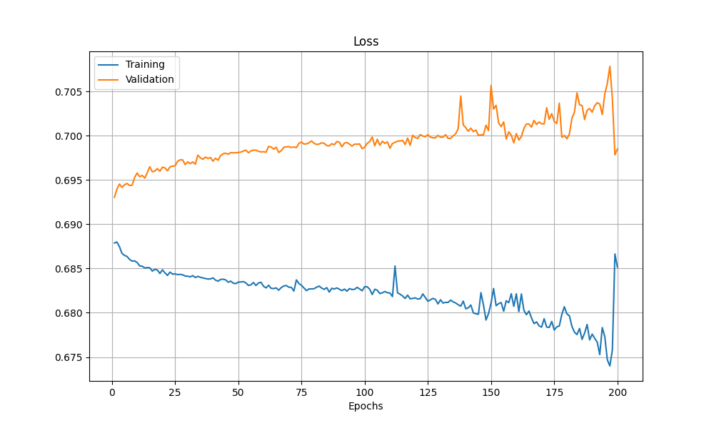

## 研究紀錄
### 25/09/15
我將 output 簡化成0和1，讓模型根據過往n根K線的走勢來預測n+1根K線的漲或跌。我認為將問題簡化可以幫助我先做出一個雛形。

### 25/09/16
- 我發現模型的準確度只在0.55左右波動，基本上模型只是在隨機預測而已，所以我決定先從資料下手。
- 原本的資料集只包含股價的 OHLC ，我認為這樣可能導致模型無法學習到足夠的特徵，所以我打算加入一些技術指標等可能和股價波動相關的數據。
    - 下圖顯示當前訓練出來的成果，我希望在不改變其他參數設置的前提下，確認改善訓練集是否對結果有幫助。

   

### 25/09/17
- 將 Volume 加入至訓練集，觀察結果是否有改善。
    - 將 Volume 直接加到訓練集當中，發現模型的 acc 和 loss 在訓練過程中沒有波動(持平)，我猜測是當前的預處理模式不適合 Volume。
    

