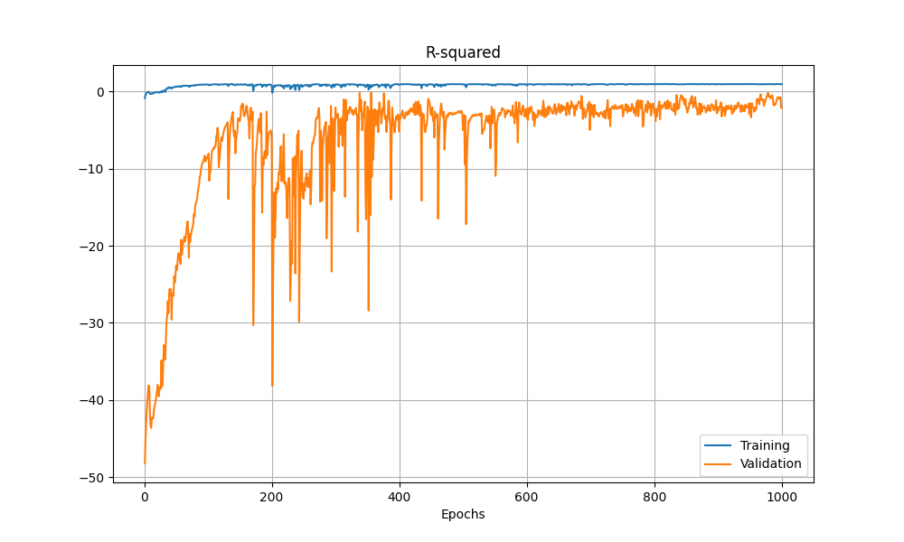

## 研究紀錄
### 25/09/15
我將 output 簡化成0和1，讓模型根據過往n根K線的走勢來預測n+1根K線的漲或跌。我認為將問題簡化可以幫助我先做出一個雛形。

### 25/09/16
- 我發現模型的準確度只在0.55左右波動，基本上模型只是在隨機預測而已，所以我決定先從資料下手。
- 原本的資料集只包含股價的 OHLC ，我認為這樣可能導致模型無法學習到足夠的特徵，所以我打算加入一些技術指標等可能和股價波動相關的數據。
    - 下圖顯示當前訓練出來的成果，我希望在不改變其他參數設置的前提下，確認改善訓練集是否對結果有幫助。

   

### 25/09/17
- 將 Volume 加入至訓練集，觀察結果是否有改善。
    - 將 Volume 直接加到訓練集當中，發現模型的 acc 和 loss 在訓練過程中沒有波動(持平)，我猜測是當前的預處理模式不適合 Volume。

### 25/09/19
- 我將 Volume 處理成 VWAP 均線，我認為這樣可以合理的方式把成交量這個變因加入訓練集。
- 我更改了LSTM模型的層數和架構，但準確度在訓練過程中又維持不動了。我不確定是遇到學習瓶頸還是甚麼。
    - 我將神經元的數量降到很低，而準確度又再次出現持平的問題，所以很明顯不是模型架構設計不當。
- 我將原本的預測漲跌，改成預測隔一天的收盤價，我想嘗試不把結果限制在0或1來試試看。
    - 訓練資料為2010年到現在的APPL價格
    - 透過每 60 根K線的 OHLC 和 VWAP 共五項，預測下一根K線的 Close。
    - 模型架構: LSTM(100)->LSTM(50)->Dropout(0.2)->Dense(1)，訓練 Epochs 1000次的結果：
    - 訓練後期的數據: 
        - Training Loss: 20~50, Training R2 > 0.9
        - Validation Loss: 1000~2000, Validation R2: -1~-3
        - Test Loss: 6404.5, Test R2: -11。
        - 我認為可能是 overfitting

   

### 25/09/20
- 我認為價格的 High 和 Low 會產生太多的噪音，所以我打算改為透過線形圖來訓練，也就是只考慮收盤價和成交量，希望可以增加 Close 和 Volume 的關聯性。
- 成交量的特徵我透過 VWAP 來輸入，希望可以增強模型對 價格和成交量 關聯的理解。
- 我嘗試將數據做規一化，但卻導致 Train MAPE 的數值變成天文數字，而 Train R2 和 Val R2 的值在訓練初期就直逼 0.95 以上。正在努力修...

### 25/09/21
- MAPE變成天文數字的問題應該是解決了，猜測是因為y接近於0，導致計算MAPE計算過程中受到影響。
- 調參數的過程中，我發現 VWAP 的計算方式錯了，我原本預計是要讓 VWAP 在每一組數據中都重新計算，不小心寫成從第一筆數據開始計算了....
    - 令我意外的是，我用原本的 VWAP (從數據的頭到尾)，準確度居然很高，但照理來說不太可能阿...
    - 我嘗試將 VWAP 改成 Volume 來看看效果
- 我在思考實際價格是否有點太困難了，如果改為預測波動率呢？例如明天可能會波動 +5% 之類的
    - 我先嘗試增加特徵，確認一下預測的準確度，預測波動率的部分之後再說
- 無論什麼品種跟週期，價格行為都是一樣的，所以我打算組合多支股票近 10 年的的歷史價格來做訓練

### 25/09/22
- 我組合了 5 支股票近 10 年來的歷史數據，總共有 13000 多筆資料，現在開始調整模型的參數...